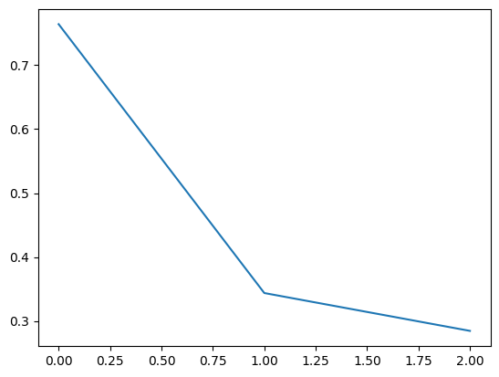

.. code:: ipython3

    # Загрузка данных
    data = supervised_df

.. code:: ipython3

    # Применение TF-IDF-векторизации
    tfidf = TfidfVectorizer(max_features=1000)  # ограничиваемся первыми 1000 признаками
    X = tfidf.fit_transform(data["VOICE_LEM"])  # работаем прямо с разреженной матрицей

.. code:: ipython3

    # Метки
    y = data["STEP_NAME"]

.. code:: ipython3

    # Преобразование классов в числовой формат
    label_map = {label: idx for idx, label in enumerate(sorted(set(y)))}
    inverse_label_map = {v: k for k, v in label_map.items()}
    y_encoded = [label_map[label] for label in y]

.. code:: ipython3

    # Удаление классов с редкими примерами (только те, что встречаются чаще одного раза)
    class_counts = np.bincount(y_encoded)
    filtered_indices = [i for i, count in enumerate(class_counts) if count > 1]
    X_filtered = X[np.isin(y_encoded, filtered_indices)].copy()
    y_filtered = [val for val in y_encoded if val in filtered_indices]

.. code:: ipython3

    # Разделяем на тренировочный и тестовый наборы
    X_train, X_test, y_train, y_test = train_test_split(X_filtered, y_filtered, test_size=0.2, random_state=42, stratify=y_filtered)

.. code:: ipython3

    # Преобразуем в PyTorch tensors
    X_train_tensor = torch.tensor(X_train.toarray()).float()
    X_test_tensor = torch.tensor(X_test.toarray()).float()
    y_train_tensor = torch.tensor(y_train).long()
    y_test_tensor = torch.tensor(y_test).long()

.. code:: ipython3

    # Наборы данных
    train_dataset = TensorDataset(X_train_tensor, y_train_tensor)
    test_dataset = TensorDataset(X_test_tensor, y_test_tensor)
    
    # Организуем загрузчики данных
    batch_size = 8
    train_loader = DataLoader(train_dataset, shuffle=True, batch_size=batch_size)
    test_loader = DataLoader(test_dataset, shuffle=False, batch_size=batch_size)

.. code:: ipython3

    # Архитектура простой полносвязной нейронной сети
    class SimpleFFNN(nn.Module):
        def __init__(self, input_dim, hidden_dim, output_dim):
            super(SimpleFFNN, self).__init__()
            self.fc1 = nn.Linear(input_dim, hidden_dim)
            self.relu = nn.ReLU()
            self.fc2 = nn.Linear(hidden_dim, output_dim)
            self.softmax = nn.Softmax(dim=1)
    
        def forward(self, x):
            x = self.fc1(x)
            x = self.relu(x)
            x = self.fc2(x)
            return x

.. code:: ipython3

    # Инициализация модели
    input_dim = X_train.shape[1]  # Входной размер равен количеству признаков
    hidden_dim = 256  # Нейроны скрытого слоя
    output_dim = len(np.unique(y_filtered))  # Количество различных классов
    
    model = SimpleFFNN(input_dim, hidden_dim, output_dim)
    criterion = nn.CrossEntropyLoss()
    optimizer = optim.Adam(model.parameters(), lr=1e-3)

.. code:: ipython3

    # Настройки обучения
    num_epochs = 3
    best_accuracy = 0
    losses = []

.. code:: ipython3

    # Тренировочный цикл
    for epoch in tqdm(range(num_epochs)):
        model.train()
        running_loss = 0.0
        for inputs, targets in train_loader:
            optimizer.zero_grad()
            outputs = model(inputs)
            loss = criterion(outputs, targets)
            loss.backward()
            optimizer.step()
            running_loss += loss.item()
        train_loss = running_loss / len(train_loader)
        losses.append(train_loss)
    
        # Тестовая оценка
        model.eval()
        all_predictions = []  # Будем накапливать предсказания здесь
        with torch.no_grad():
            for inputs, targets in test_loader:
                outputs = model(inputs)
                _, predicted = torch.max(outputs, 1)
                all_predictions.extend(predicted.cpu().numpy())  # добавляем предсказания
    
        # Расчёт точности
        accuracy = sum(p == t for p, t in zip(all_predictions, y_test)) / len(y_test)
    
        # Логгирование показателей
        print(f"Эпоха [{epoch+1}/{num_epochs}], Train Loss: {train_loss:.4f}, Test Accuracy: {accuracy:.4f}")
        if accuracy > best_accuracy:
            best_accuracy = accuracy
            torch.save(model.state_dict(), "simple_ffnn_model.pt")
    
    plt.plot(losses)

.. parsed-literal::

      0%|          | 0/3 [00:00<?, ?it/s]

.. parsed-literal::

    Эпоха [1/3], Train Loss: 0.7642, Test Accuracy: 0.8817
    Эпоха [2/3], Train Loss: 0.3436, Test Accuracy: 0.8898
    Эпоха [3/3], Train Loss: 0.2844, Test Accuracy: 0.8908
    

.. parsed-literal::

    [<matplotlib.lines.Line2D at 0x7994eb362e90>]

.. code:: ipython3

    # Конечные отчёты
    print(f"\nЛучшая точность на тестовой выборке: {best_accuracy:.4f}")
    
    # Декодируем метки обратно в читаемые названия
    decoded_targets = [inverse_label_map[t.item()] for t in y_test_tensor]
    decoded_preds = [inverse_label_map[p] for p in all_predictions]
    
    # Генерируем отчет классификации
    report = classification_report(decoded_targets, decoded_preds)
    print("\nКлассификация отчета:")
    print(report)

.. parsed-literal::

    
    Лучшая точность на тестовой выборке: 0.8908
    
    Классификация отчета:
                                             precision    recall  f1-score   support
    
                                        PIN       0.86      0.94      0.90       308
                                    endStep       0.25      0.04      0.06        27
                                 Автоплатеж       0.71      0.87      0.78        23
               Адреса и режим работы офисов       0.79      0.90      0.84        98
                                     Аресты       0.96      0.98      0.97        55
                               Баланс карты       0.93      0.96      0.95       746
                    Блокировка или закрытие       0.33      0.04      0.08       140
                                     Вклады       0.94      0.95      0.95       456
                                        ГОП       0.85      0.89      0.87        38
                          Денежные переводы       0.93      0.97      0.95       558
                         Ежемесячный платеж       0.94      0.94      0.94       548
                                   Закрытие       0.59      0.85      0.70       393
                             Закрытие счёта       0.99      0.95      0.97       123
                               Изменение ПД       0.95      0.80      0.86        44
                   Изменить кредитный лимит       0.83      0.62      0.71        16
                                    Ипотека       1.00      0.91      0.95        11
                                   Комиссия       1.00      0.83      0.91         6
                         Кредитные каникулы       0.98      0.94      0.96        65
                        Курс и обмен валюты       0.99      0.95      0.97        77
                                     Кэшбэк       0.95      0.97      0.96        99
                             Логин и пароль       0.50      0.43      0.46         7
                            Льготный период       0.89      1.00      0.94        32
                             МБ/FIX/SPUTNIK       0.94      0.94      0.94      1209
                                        МСБ       1.00      0.08      0.16        59
                                    МТС Pay       1.00      0.88      0.93         8
                              Мошенничество       0.91      0.87      0.89       207
                            Не приходит код       0.86      0.75      0.80         8
                      Номер договора, счёта       0.89      0.91      0.90       139
                                        ОМТ       0.96      0.95      0.95       345
                              Остаток (ПДП)       0.93      0.94      0.93       941
                           Отключить услуги       0.86      0.89      0.88        71
                             Оформить карту       0.62      0.76      0.69       267
                            Оформить кредит       0.87      0.92      0.89       263
                             Ошибка в имени       1.00      0.50      0.67         6
                                     Пароль       0.20      0.17      0.18         6
                           Перевыпуск карты       0.96      0.96      0.96        28
        Проблемы со входом в личный кабинет       0.91      0.91      0.91       385
                Пропущенный звонок от банка       0.64      0.11      0.18       133
                 Просроченная задолженность       0.93      0.99      0.96        86
                                  Прощаемся       0.96      1.00      0.98        47
    Разблокировать/заблокировать приложение       0.82      0.85      0.83       149
                              Разблокировка       0.94      0.94      0.94       277
                                       Спам       0.50      0.92      0.65        26
                                   Списания       0.92      0.97      0.95       154
                             Способы оплаты       0.91      0.84      0.87       356
                          Справки и выписки       0.98      0.97      0.97        99
              Статус заявки на кредит/карту       0.92      0.89      0.90       306
                                  Страховка       0.98      0.97      0.97       177
                                Счетчик ПИН       0.00      0.00      0.00         2
                            Увеличить лимит       0.95      0.95      0.95       121
           Узнать кредитный лимит + остаток       0.79      0.87      0.83        69
                            Уменьшить лимит       0.99      0.92      0.95        95
                       Установка приложения       0.85      0.84      0.84       148
                           Чат с оператором       1.00      0.14      0.25        14
    
                                   accuracy                           0.89     10071
                                  macro avg       0.84      0.78      0.79     10071
                               weighted avg       0.89      0.89      0.88     10071
    
    

.. parsed-literal::

    /usr/local/lib/python3.11/dist-packages/sklearn/metrics/_classification.py:1565: UndefinedMetricWarning: Precision is ill-defined and being set to 0.0 in labels with no predicted samples. Use `zero_division` parameter to control this behavior.
      _warn_prf(average, modifier, f"{metric.capitalize()} is", len(result))
    /usr/local/lib/python3.11/dist-packages/sklearn/metrics/_classification.py:1565: UndefinedMetricWarning: Precision is ill-defined and being set to 0.0 in labels with no predicted samples. Use `zero_division` parameter to control this behavior.
      _warn_prf(average, modifier, f"{metric.capitalize()} is", len(result))
    /usr/local/lib/python3.11/dist-packages/sklearn/metrics/_classification.py:1565: UndefinedMetricWarning: Precision is ill-defined and being set to 0.0 in labels with no predicted samples. Use `zero_division` parameter to control this behavior.
      _warn_prf(average, modifier, f"{metric.capitalize()} is", len(result))
    

.. code:: ipython3

    if __name__ == "__main__":
        # Основной путь к данным для моделирования
        file_path_model = '/content/lsir_recognition_2025-06-23.xlsx'
    
        # Обработка основного набора данных
        supervised_df = preprocess_data(file_path_model)

.. code:: ipython3

    # Загрузка датасета для тестирования
    testing_df = supervised_df

.. code:: ipython3

    # Векторизация TF-IDF
    tfidf = TfidfVectorizer(max_features=1000)  # Используем максимум 1000 признаков
    tfidf.fit(testing_df["VOICE_LEM"])  # Обучаем векторизатор на данных
    
    # Сохраняем векторизатор
    with open("tfidf_vectorizer.pkl", "wb") as f:
        pickle.dump(tfidf, f)
    
    # Преобразование текста в эмбеддинги
    X_test = tfidf.transform(testing_df["VOICE"]).todense()

.. code:: ipython3

    # Преобразование в PyTorch-тензоры
    X_test_tensor = torch.FloatTensor(X_test)

.. code:: ipython3

    # Создание датасетов и загрузчиков
    test_dataset = TensorDataset(X_test_tensor)
    test_loader = DataLoader(test_dataset, batch_size=64, shuffle=False)

.. code:: ipython3

    # Архитектура модели
    class SimpleFFNN(torch.nn.Module):
        def __init__(self, input_dim, hidden_dim, output_dim):
            super(SimpleFFNN, self).__init__()
            self.fc1 = torch.nn.Linear(input_dim, hidden_dim)
            self.relu = torch.nn.ReLU()
            self.fc2 = torch.nn.Linear(hidden_dim, output_dim)
            self.softmax = torch.nn.Softmax(dim=1)
    
        def forward(self, x):
            x = self.fc1(x)
            x = self.relu(x)
            x = self.fc2(x)
            return x
    
    # Размеры модели
    input_dim = X_test.shape[1]  # Входной размер
    hidden_dim = 256  # Количество нейронов скрытого слоя
    output_dim = len(inverse_label_map)  # Количество классов
    
    # Загрузка модели
    model = SimpleFFNN(input_dim, hidden_dim, output_dim)
    model.load_state_dict(torch.load("simple_ffnn_model.pt"))  # Загружаем сохранённую модель
    model.eval()  # Режим оценки

.. parsed-literal::

    SimpleFFNN(
      (fc1): Linear(in_features=1000, out_features=256, bias=True)
      (relu): ReLU()
      (fc2): Linear(in_features=256, out_features=55, bias=True)
      (softmax): Softmax(dim=1)
    )

.. code:: ipython3

    # Массивы для хранения результатов
    all_predictions = []
    confidences = []
    
    # Прогностическое прохождение по тестовым данным
    with torch.no_grad():
        for inputs in tqdm(test_loader, desc="Прогнозирование...", leave=True):
            outputs = model(inputs[0])
            probs = torch.softmax(outputs, dim=1)
            predictions = torch.argmax(probs, dim=1).numpy()
            confidence = probs.max(dim=1)[0].numpy()
    
            all_predictions.extend(predictions)
            confidences.extend(confidence)
    
    # Преобразуем результаты в DataFrame
    result_df = pd.DataFrame({
        "PREDICTED_CLASS": all_predictions,
        "% УВЕРЕННОСТИ": confidences
    })

.. parsed-literal::

    Прогнозирование...:   0%|          | 0/705 [00:00<?, ?it/s]

.. code:: ipython3

    result_df["PREDICTED_CLASS"] = result_df["PREDICTED_CLASS"].astype(int).apply(lambda x: inverse_label_map.get(x, "Unknown"))
    
    # Присоединяем результаты к исходному датасету
    final_result = testing_df.reset_index(drop=True).merge(
        result_df.reset_index(drop=True),
        left_index=True,
        right_index=True,
        how='left'
    )
    
    # Сохраняем итоговый результат в Excel
    final_result.to_excel("predicted_results.xlsx", index=False)
    print(final_result)
    print("Результат сохранён в файле 'predicted_results.xlsx'.")

.. parsed-literal::

                                         STEP_NAME  \
    0                                Разблокировка   
    1                                     Закрытие   
    2                                 Баланс карты   
    3      Разблокировать/заблокировать приложение   
    4                           Ежемесячный платеж   
    ...                                        ...   
    45067                                   Вклады   
    45068                             Баланс карты   
    45069                           Оформить карту   
    45070            Статус заявки на кредит/карту   
    45071                                   Кэшбэк   
    
                                                       VOICE  \
    0                            насчёт карты разблокировать   
    1                                                  верно   
    2                                           баланс карты   
    3                     разблокировать вход личный кабинет   
    4                                         поводу платежа   
    ...                                                  ...   
    45067  хотел узнать могу открыть сегодняшний день э н...   
    45068                                 баланс карты стоит   
    45069                                        отправиться   
    45070                    отменить заявку кредитную карту   
    45071                                             кэшбэк   
    
                                                   VOICE_LEM  \
    0                            насчёт карта разблокировать   
    1                                                  верно   
    2                                           баланс карта   
    3                     разблокировать вход личный кабинет   
    4                                           повод платёж   
    ...                                                  ...   
    45067  хотеть узнать мочь открыть сегодняшний день э ...   
    45068                                баланс карта стоить   
    45069                                        отправиться   
    45070                    отменить заявка кредитный карта   
    45071                                             кэшбэк   
    
                               PREDICTED_CLASS  % УВЕРЕННОСТИ  
    0                           Оформить карту       0.425659  
    1                           Оформить карту       0.306499  
    2                           Оформить карту       0.389310  
    3      Проблемы со входом в личный кабинет       0.783068  
    4                           Оформить карту       0.282781  
    ...                                    ...            ...  
    45067                        Остаток (ПДП)       0.395439  
    45068                       Оформить карту       0.389310  
    45069                       Оформить карту       0.282781  
    45070          Пропущенный звонок от банка       0.249872  
    45071                               Кэшбэк       0.999539  
    
    [45072 rows x 5 columns]
    Результат сохранён в файле 'predicted_results.xlsx'.
    
