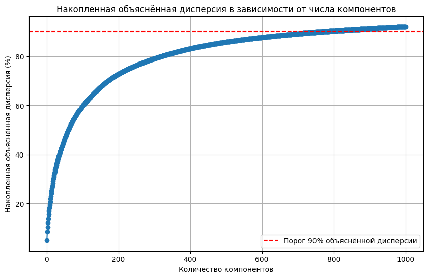
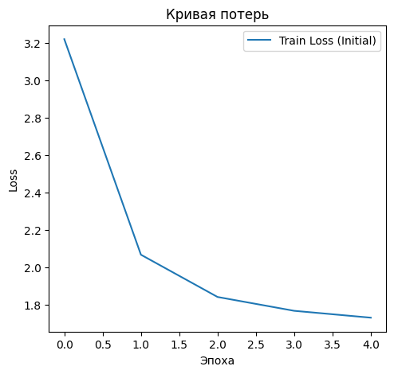

.. code:: ipython3

    # Данные
    data = supervised_df

.. code:: ipython3

    # Проверка целостности данных
    if data.empty or "VOICE_LEM" not in data.columns or "STEP_NAME" not in data.columns:
        raise ValueError("Данные пусты или отсутствуют столбцы 'VOICE_LEM' или 'STEP_NAME'")
    if data["STEP_NAME"].isna().any():
        raise ValueError("В 'STEP_NAME' есть пропущенные значения")
    
    # Проверка длины реплик
    lengths = [len(text.split()) for text in data["VOICE_LEM"] if isinstance(text, str)]
    print(f"Средняя длина реплик: {np.mean(lengths):.2f}, макс: {max(lengths)}, 95-й перцентиль: {np.percentile(lengths, 95):.2f}")

.. parsed-literal::

    Средняя длина реплик: 4.43, макс: 48, 95-й перцентиль: 11.00
    

.. code:: ipython3

    # Функция для генерации эмбеддингов с помощью TF-IDF
    def generate_tfidf_embeddings(data, column="VOICE_LEM", max_features=None, use_idf=True, sublinear_tf=True):
        """Создает TF-IDF эмбеддинги"""
        vectorizer = TfidfVectorizer(max_features=max_features, use_idf=use_idf, sublinear_tf=sublinear_tf)
        embeddings = vectorizer.fit_transform(data[column])
        return embeddings, vectorizer

.. code:: ipython3

    # Кэширование эмбеддингов
    embeddings_file = "tfidf_embeddings.npz"
    vocab_file = "tfidf_vocabulary.txt"
    
    if os.path.exists(embeddings_file):
        print("Загрузка эмбеддингов из кэша...")
        X = load_npz(embeddings_file)
    else:
        print("Генерация эмбеддингов...")
        X, vectorizer = generate_tfidf_embeddings(data)
        save_npz(embeddings_file, X)
        np.savetxt(vocab_file, vectorizer.get_feature_names_out(), fmt='%s')
    
    y = data["STEP_NAME"]

.. parsed-literal::

    Генерация эмбеддингов...
    

.. code:: ipython3

    # Проверка размеров
    if X.shape[0] != len(y):
        raise ValueError(f"Несоответствие размеров: X ({X.shape[0]}) и y ({len(y)})")

.. code:: ipython3

    # Проверка доли нулевых последовательностей
    # Поскольку X - разреженная матрица, проверять полностью нулевые строки сложнее, но можно оценить долю значимых элементов (non-zero elements)
    nonzero_elements_ratio = X.getnnz() / (X.shape[0] * X.shape[1])
    print(f"Доля ненулевых элементов: {nonzero_elements_ratio:.2%}")

.. parsed-literal::

    Доля ненулевых элементов: 0.05%
    

.. code:: ipython3

    # Преобразование классов в числовой формат
    label_map = {label: idx for idx, label in enumerate(sorted(set(y)))}
    inverse_label_map = {v: k for k, v in label_map.items()}
    y_encoded = np.array([label_map[label] for label in y])
    
    # Анализ классов
    class_counts = Counter(y_encoded)
    print("Распределение классов до фильтрации:", {inverse_label_map[k]: v for k, v in class_counts.items()})
    

.. parsed-literal::

    Распределение классов до фильтрации: {'Оформить карту': 1335, 'МБ/FIX/SPUTNIK': 6045, 'Статус заявки на кредит/карту': 1528, 'Справки и выписки': 494, 'Увеличить лимит': 605, 'Вклады': 2280, 'ОМТ': 1726, 'Закрытие счёта': 613, 'Просроченная задолженность': 431, 'Ежемесячный платеж': 2739, 'Денежные переводы': 2791, 'Остаток (ПДП)': 4707, 'Баланс карты': 3729, 'Способы оплаты': 1782, 'Блокировка или закрытие': 701, 'Оформить кредит': 1315, 'Разблокировка': 1384, 'Закрытие': 1965, 'Ипотека': 57, 'Изменение ПД': 219, 'Установка приложения': 741, 'Кэшбэк': 493, 'Уменьшить лимит': 477, 'Пропущенный звонок от банка': 665, 'Адреса и режим работы офисов': 488, 'Узнать кредитный лимит + остаток': 347, 'Мошенничество': 1035, 'Проблемы со входом в личный кабинет': 1923, 'Страховка': 884, 'PIN': 1538, 'Номер договора, счёта': 697, 'Автоплатеж': 116, 'Разблокировать/заблокировать приложение': 744, 'Списания': 768, 'Комиссия': 32, 'Курс и обмен валюты': 383, 'МСБ': 295, 'Спам': 130, 'endStep': 136, 'Прощаемся': 236, 'Логин и пароль': 36, 'Отключить услуги': 353, 'Перевыпуск карты': 139, 'Чат с оператором': 72, 'Кредитные каникулы': 324, 'Аресты': 276, 'Пароль': 29, 'Льготный период': 162, 'ГОП': 191, 'Изменить кредитный лимит': 81, 'Счетчик ПИН': 8, 'МТС Pay': 39, 'Не приходит код': 39, 'Ошибка в имени': 28, 'Карта UnionPay': 2}
    

.. code:: ipython3

    # Фильтрация классов с менее чем 5 примерами
    min_samples = 5
    filtered_indices = [i for i, count in enumerate(np.bincount(y_encoded)) if count >= min_samples]
    if not filtered_indices:
        raise ValueError("После фильтрации не осталось классов.")
    
    X_filtered = X[np.isin(y_encoded, filtered_indices)]
    y_filtered = np.array([val for val in y_encoded if val in filtered_indices])
    
    # Проверка размеров
    if X_filtered.shape[0] != y_filtered.shape[0]:
        raise ValueError(f"Несоответствие размеров после фильтрации: X ({len(X_filtered)}) и y ({len(y_filtered)})")
    
    # Проверка распределения классов
    filtered_class_counts = Counter(y_filtered)
    print("Распределение классов после фильтрации:", {inverse_label_map[k]: v for k, v in filtered_class_counts.items()})

.. parsed-literal::

    Распределение классов после фильтрации: {'Оформить карту': 1335, 'МБ/FIX/SPUTNIK': 6045, 'Статус заявки на кредит/карту': 1528, 'Справки и выписки': 494, 'Увеличить лимит': 605, 'Вклады': 2280, 'ОМТ': 1726, 'Закрытие счёта': 613, 'Просроченная задолженность': 431, 'Ежемесячный платеж': 2739, 'Денежные переводы': 2791, 'Остаток (ПДП)': 4707, 'Баланс карты': 3729, 'Способы оплаты': 1782, 'Блокировка или закрытие': 701, 'Оформить кредит': 1315, 'Разблокировка': 1384, 'Закрытие': 1965, 'Ипотека': 57, 'Изменение ПД': 219, 'Установка приложения': 741, 'Кэшбэк': 493, 'Уменьшить лимит': 477, 'Пропущенный звонок от банка': 665, 'Адреса и режим работы офисов': 488, 'Узнать кредитный лимит + остаток': 347, 'Мошенничество': 1035, 'Проблемы со входом в личный кабинет': 1923, 'Страховка': 884, 'PIN': 1538, 'Номер договора, счёта': 697, 'Автоплатеж': 116, 'Разблокировать/заблокировать приложение': 744, 'Списания': 768, 'Комиссия': 32, 'Курс и обмен валюты': 383, 'МСБ': 295, 'Спам': 130, 'endStep': 136, 'Прощаемся': 236, 'Логин и пароль': 36, 'Отключить услуги': 353, 'Перевыпуск карты': 139, 'Чат с оператором': 72, 'Кредитные каникулы': 324, 'Аресты': 276, 'Пароль': 29, 'Льготный период': 162, 'ГОП': 191, 'Изменить кредитный лимит': 81, 'Счетчик ПИН': 8, 'МТС Pay': 39, 'Не приходит код': 39, 'Ошибка в имени': 28}
    

.. code:: ipython3

    # Разделение на тренировочный, валидационный и тестовый наборы
    X_temp, X_test, y_temp, y_test = train_test_split(
        X_filtered, y_filtered, test_size=0.1, random_state=42, stratify=y_filtered
    )
    X_train, X_val, y_train, y_val = train_test_split(
        X_temp, y_temp, test_size=0.1, random_state=42, stratify=y_temp
    )
    
    # Сохранение индексов тестового набора для кластеризации
    test_indices = np.arange(X_filtered.shape[0])[np.isin(np.arange(X_filtered.shape[0]), np.where(np.isin(y_filtered, y_test)))]

.. code:: ipython3

    # Проверка наличия всех классов
    train_classes = set(y_train)
    val_classes = set(y_val)
    test_classes = set(y_test)
    all_classes = set(y_filtered)
    
    missing_in_train = all_classes - train_classes
    if missing_in_train:
        raise ValueError(f"В тренировочном наборе отсутствуют классы: {missing_in_train}")
    
    missing_in_val = all_classes - val_classes
    if missing_in_val:
        print(f"Предупреждение: в валидационном наборе отсутствуют классы: {missing_in_val}")
    
    missing_in_test = all_classes - test_classes
    if missing_in_test:
        print(f"Предупреждение: в тестовом наборе отсутствуют классы: {missing_in_test}")
    
    # Проверка размеров
    print(f"Размеры наборов: train={X_train.shape[0]}, val={X_val.shape[0]}, test={X_test.shape[0]}")

.. parsed-literal::

    Размеры наборов: train=40783, val=4532, test=5036
    

.. code:: ipython3

    # Примерный диапазон для максимального числа компонентов
    max_components = min(X_train.shape[1], 1000)  # Ограничим число компонентов доступным количеством признаков
    
    # Используем TruncatedSVD
    svd = TruncatedSVD(n_components=max_components, random_state=42)
    svd.fit(X_train)
    
    # Посчитаем накопленную объясняемую дисперсию
    cumulative_explained_variance = np.cumsum(svd.explained_variance_ratio_) * 100

.. code:: ipython3

    # Рисуем график
    plt.figure(figsize=(10, 6))
    plt.plot(range(1, max_components + 1), cumulative_explained_variance, marker='o')
    plt.axhline(y=90, color='red', linestyle='--', label='Порог 90% объяснённой дисперсии')
    plt.xlabel('Количество компонентов')
    plt.ylabel('Накопленная объяснённая дисперсия (%)')
    plt.title('Накопленная объяснённая дисперсия в зависимости от числа компонентов')
    plt.legend()
    plt.grid(True)
    plt.show()

.. code:: ipython3

    # Нахождение оптимального числа компонентов
    optimal_components = next((i for i, var in enumerate(cumulative_explained_variance) if var >= 90), None)

.. code:: ipython3

    # Если оптимальное число компонентов не найдено, устанавливаем дефолтное значение
    if optimal_components is None:
        optimal_components = 100  # Или любое другое разумное значение
    
    print(f"\nОптимальное число компонентов (>= 90% объяснённой дисперсии): {optimal_components}\n")

.. parsed-literal::

    
    Оптимальное число компонентов (>= 90% объяснённой дисперсии): 770
    
    

.. code:: ipython3

    # Используем оптимальное число компонентов для фактического снижения размерности
    final_svd = TruncatedSVD(n_components=optimal_components, random_state=42)
    X_train_reduced = final_svd.fit_transform(X_train)
    X_val_reduced = final_svd.transform(X_val)
    X_test_reduced = final_svd.transform(X_test)
    
    # Преобразование в PyTorch-тензоры
    X_train_tensor = torch.tensor(X_train_reduced, dtype=torch.float)
    X_val_tensor = torch.tensor(X_val_reduced, dtype=torch.float)
    X_test_tensor = torch.tensor(X_test_reduced, dtype=torch.float)
    
    # Кодируем категориальные метки в числовой формат
    le = LabelEncoder()
    y_train_encoded = le.fit_transform(y_train)
    y_val_encoded = le.transform(y_val)
    y_test_encoded = le.transform(y_test)
    
    # Преобразование меток в тензоры
    y_train_tensor = torch.tensor(y_train_encoded, dtype=torch.long)
    y_val_tensor = torch.tensor(y_val_encoded, dtype=torch.long)
    y_test_tensor = torch.tensor(y_test_encoded, dtype=torch.long)

.. code:: ipython3

    # Класс Dataset
    class TextDataset(Dataset):
        def __init__(self, X, y):
            self.X = X
            self.y = y
    
        def __getitem__(self, index):
            return self.X[index], self.y[index]
    
        def __len__(self):
            return len(self.X)

.. code:: ipython3

    # Создание датасетов и загрузчиков
    batch_size = 256
    train_dataset = TextDataset(X_train_tensor, y_train_tensor)
    val_dataset = TextDataset(X_val_tensor, y_val_tensor)
    test_dataset = TextDataset(X_test_tensor, y_test_tensor)
    
    train_loader = DataLoader(train_dataset, shuffle=True, batch_size=batch_size, num_workers=2, pin_memory=True)
    val_loader = DataLoader(val_dataset, shuffle=False, batch_size=batch_size, num_workers=2, pin_memory=True)
    test_loader = DataLoader(test_dataset, shuffle=False, batch_size=batch_size, num_workers=2, pin_memory=True)
    
    # Вычисление весов классов
    class_weights = np.array([1.0 / count for count in Counter(y_train).values()])
    class_weights = torch.tensor(class_weights, dtype=torch.float)
    class_weights = class_weights / class_weights.sum()
    class_weights = class_weights.to(torch.device("cuda" if torch.cuda.is_available() else "cpu"))

.. code:: ipython3

    # Определение LSTM-модели
    class LSTMClf(nn.Module):
        def __init__(self, input_dim, hidden_dim, num_layers, output_dim, dropout_rate=0.3, bidirectional=True):
            super(LSTMClf, self).__init__()
            self.lstm = nn.LSTM(
                input_dim, hidden_dim, num_layers=num_layers, batch_first=True,
                bidirectional=bidirectional, dropout=dropout_rate if num_layers > 1 else 0
            )
            direction_factor = 2 if bidirectional else 1
            self.fc = nn.Linear(direction_factor * hidden_dim, output_dim)
            self.dropout = nn.Dropout(dropout_rate)
    
        def forward(self, x):
            out, _ = self.lstm(x)
            out = self.dropout(out[:, -1, :])
            return self.fc(out)

.. code:: ipython3

    # Параметры модели
    input_dim = optimal_components  # Новая размерность после снижения размерности
    hidden_dim = 256
    num_layers = 2
    output_dim = len(np.unique(y_filtered))

.. code:: ipython3

    # Обновляем модель с новой размерностью входных данных
    model = LSTMClf(input_dim, hidden_dim, num_layers, output_dim, dropout_rate=0.3, bidirectional=True)
    device = torch.device("cuda" if torch.cuda.is_available() else "cpu")
    model.to(device)

.. parsed-literal::

    LSTMClf(
      (lstm): LSTM(770, 256, num_layers=2, batch_first=True, dropout=0.3, bidirectional=True)
      (fc): Linear(in_features=512, out_features=54, bias=True)
      (dropout): Dropout(p=0.3, inplace=False)
    )

.. code:: ipython3

    # Функция потерь с label smoothing
    class LabelSmoothingCrossEntropy(nn.Module):
        def __init__(self, smoothing=0.2):
            super(LabelSmoothingCrossEntropy, self).__init__()
            self.smoothing = smoothing
    
        def forward(self, input, target):
            log_probs = torch.nn.functional.log_softmax(input, dim=-1)
            n_classes = input.size(-1)
            true_dist = torch.zeros_like(log_probs).fill_(self.smoothing / (n_classes - 1))
            true_dist.scatter_(1, target.unsqueeze(1), 1.0 - self.smoothing)
            return torch.mean(torch.sum(-true_dist * log_probs, dim=-1))

.. code:: ipython3

    # Настройка обучения
    criterion = LabelSmoothingCrossEntropy(smoothing=0.2)
    optimizer = optim.Adam(model.parameters(), lr=1e-3, weight_decay=1e-4)
    
    num_epochs = 5
    best_f1 = 0
    patience = 5
    counter = 0
    train_losses = []
    val_f1_scores = []

.. code:: ipython3

    # Тренировочный цикл
    for epoch in tqdm(range(num_epochs)):
        model.train()
        running_loss = 0.0
        for inputs, targets in train_loader:
            # Добавляем ось последовательности
            inputs = inputs.unsqueeze(1)  # Now inputs has shape [batch_size, 1, input_dim]
            inputs, targets = inputs.to(device, non_blocking=True), targets.to(device, non_blocking=True)
            optimizer.zero_grad()
            outputs = model(inputs)
            loss = criterion(outputs, targets)
            loss.backward()
            optimizer.step()
            running_loss += loss.item()
        train_loss = running_loss / len(train_loader)
        train_losses.append(train_loss)
    
        # Оценка на валидационной выборке
        model.eval()
        all_predictions = []
        all_targets = []
        with torch.no_grad():
            for inputs, targets in val_loader:
                # Добавляем ось последовательности
                inputs = inputs.unsqueeze(1)  # Now inputs has shape [batch_size, 1, input_dim]
                inputs, targets = inputs.to(device, non_blocking=True), targets.to(device, non_blocking=True)
                outputs = model(inputs)
                _, predicted = torch.max(outputs, 1)
                all_predictions.extend(predicted.cpu().numpy())
                all_targets.extend(targets.cpu().numpy())
    
        val_accuracy = sum(p == t for p, t in zip(all_predictions, all_targets)) / len(all_targets)
        val_f1 = f1_score(all_targets, all_predictions, average='weighted', zero_division=0)
        val_precision = precision_score(all_targets, all_predictions, average='weighted', zero_division=0)
        val_recall = recall_score(all_targets, all_predictions, average='weighted', zero_division=0)
        val_per_class_f1 = f1_score(all_targets, all_predictions, average=None, zero_division=0)
    
        print(f"Эпоха [{epoch+1}/{num_epochs}], Train Loss: {train_loss:.4f}, "
              f"Val Accuracy: {val_accuracy:.4f}, Val F1: {val_f1:.4f}, "
              f"Val Precision: {val_precision:.4f}, Val Recall: {val_recall:.4f}")
    
        # Early Stopping
        if val_f1 > best_f1:
            best_f1 = val_f1
            torch.save(model.state_dict(), "lstm_model.pt")
            counter = 0
        else:
            counter += 1
            if counter >= patience:
                print("Раннее прекращение: валидационная метрика не улучшается.")
                break

.. parsed-literal::

      0%|          | 0/5 [00:00<?, ?it/s]

.. parsed-literal::

    Эпоха [1/5], Train Loss: 3.2183, Val Accuracy: 0.6483, Val F1: 0.5680, Val Precision: 0.5522, Val Recall: 0.6483
    Эпоха [2/5], Train Loss: 2.0676, Val Accuracy: 0.8345, Val F1: 0.8075, Val Precision: 0.8132, Val Recall: 0.8345
    Эпоха [3/5], Train Loss: 1.8420, Val Accuracy: 0.8656, Val F1: 0.8482, Val Precision: 0.8496, Val Recall: 0.8656
    Эпоха [4/5], Train Loss: 1.7681, Val Accuracy: 0.8749, Val F1: 0.8579, Val Precision: 0.8591, Val Recall: 0.8749
    Эпоха [5/5], Train Loss: 1.7314, Val Accuracy: 0.8775, Val F1: 0.8625, Val Precision: 0.8733, Val Recall: 0.8775
    

.. code:: ipython3

    # Построение графика потерь
    plt.figure(figsize=(12, 5))
    plt.subplot(1, 2, 1)
    plt.plot(train_losses, label='Train Loss (Initial)')
    plt.xlabel('Эпоха')
    plt.ylabel('Loss')
    plt.title('Кривая потерь')
    plt.legend()

.. parsed-literal::

    <matplotlib.legend.Legend at 0x7e2694a9fd10>

.. code:: ipython3

    # Загрузка модели и подготовка к оценке
    model.load_state_dict(torch.load("lstm_model.pt"))
    model.eval()
    
    # Карта классов
    label_map = {label: idx for idx, label in enumerate(sorted(set(y)))}
    inverse_label_map = {v: k for k, v in label_map.items()}
    
    # Структуры для хранения данных
    detailed_data = {
        "Фраза": [],
        "Реальный класс": [],
        "Прогноз": [],
        "Уверенность (%)": []
    }
    
    all_predictions = []
    all_targets = []

.. code:: ipython3

    with torch.no_grad():
        for batch_idx, (inputs, targets) in enumerate(test_loader):
            # Начало и конец батча
            start_idx = batch_idx * test_loader.batch_size
            end_idx = min(start_idx + len(inputs), len(data))
    
            # Получаем исходные тексты и реальные классы
            original_phrases = data.iloc[start_idx:end_idx]['VOICE_LEM']
            true_classes = data.iloc[start_idx:end_idx]['STEP_NAME']
    
            inputs = inputs.unsqueeze(1)
            inputs, targets = inputs.to(device, non_blocking=True), targets.to(device, non_blocking=True)
            outputs = model(inputs)
            probs = F.softmax(outputs, dim=1)
            max_probs, predicted = torch.max(probs, 1)
    
            # Сохраняем данные
            detailed_data["Фраза"].extend(original_phrases.values)
            detailed_data["Реальный класс"].extend(true_classes.values)
            detailed_data["Прогноз"].extend([inverse_label_map[pred.item()] for pred in predicted])
            detailed_data["Уверенность (%)"].extend(max_probs.cpu().numpy() * 100)
    
            # Данные для метрик
            all_predictions.extend(predicted.cpu().numpy())
            all_targets.extend(targets.cpu().numpy())

.. code:: ipython3

    # Преобразуем в DataFrame и сохраняем в Excel
    detailed_df = pd.DataFrame(detailed_data)
    detailed_df.to_excel("detailed_classification_results.xlsx", index=False)

.. code:: ipython3

    # Основные метрики с контролем zero_division
    all_predictions = np.array(all_predictions)
    all_targets = np.array(all_targets)
    
    accuracy = accuracy_score(all_targets, all_predictions)
    f1 = f1_score(all_targets, all_predictions, average="macro", zero_division=0)
    precision = precision_score(all_targets, all_predictions, average="macro", zero_division=0)
    recall = recall_score(all_targets, all_predictions, average="macro", zero_division=0)
    

.. code:: ipython3

    # Итоговая таблица
    summary_df = pd.DataFrame({
        "Метрика": ["Accuracy", "F1 Score", "Precision", "Recall"],
        "Значение": [accuracy, f1, precision, recall]
    }).round(4)
    
    # Вывод итоговой таблицы
    print(summary_df)
    
    print(detailed_df)
    
    # Сохраняем итоговую таблицу в Excel
    summary_df.to_excel("classification_summary.xlsx", index=False)
    
    print("\nДетальная таблица с результатами успешно сохранена в detailed_classification_results.xlsx!")
    print("Итоги обобщённых метрик успешно сохранены в classification_summary.xlsx!")

.. parsed-literal::

         Метрика  Значение
    0   Accuracy    0.8711
    1   F1 Score    0.6638
    2  Precision    0.6594
    3     Recall    0.6756
                                                      Фраза  \
    0     оформить карта кредитный улучшение кредитный и...   
    1                       соединить установка телевидение   
    2                       хотеть заказать кредитный карта   
    3                               запросить выписка конец   
    4                                       закрытие кредит   
    ...                                                 ...   
    5031  ээ положить деньга оплата кредит неправильно н...   
    5032                                узнать баланс карта   
    5033    почему отображаться минимальный платёж кредитка   
    5034                                            перевод   
    5035                                              верно   
    
                         Реальный класс                Прогноз  Уверенность (%)  
    0                    Оформить карту               Списания        15.011936  
    1                    МБ/FIX/SPUTNIK  Номер договора, счёта        63.811821  
    2     Статус заявки на кредит/карту      Денежные переводы        16.216764  
    3                 Справки и выписки                 Вклады        68.726288  
    4                    МБ/FIX/SPUTNIK           Баланс карты        78.124580  
    ...                             ...                    ...              ...  
    5031                 Способы оплаты                 Вклады        84.790932  
    5032                   Баланс карты                    PIN        89.041748  
    5033             Ежемесячный платеж  Номер договора, счёта        74.585243  
    5034              Денежные переводы                    ОМТ        89.392075  
    5035        Блокировка или закрытие           Баланс карты        85.822617  
    
    [5036 rows x 4 columns]
    
    Детальная таблица с результатами успешно сохранена в detailed_classification_results.xlsx!
    Итоги обобщённых метрик успешно сохранены в classification_summary.xlsx!
    

.. code:: ipython3

    # Построение confusion matrix для первой модели
    cm_initial = confusion_matrix(all_targets, all_predictions)
    
    # Формирование DataFrame для записи в Excel
    df_cm = pd.DataFrame(
        cm_initial,
        index=[inverse_label_map[i] for i in range(output_dim)],   # Метки строк
        columns=[inverse_label_map[i] for i in range(output_dim)]  # Метки столбцов
    )
    
    # Сохраняем в Excel файл
    output_file_path = 'confusion_matrix.xlsx'
    df_cm.to_excel(output_file_path)
    
    print(f'Матрица путаницы сохранена в {output_file_path}')

.. parsed-literal::

    Матрица путаницы сохранена в confusion_matrix.xlsx
    
